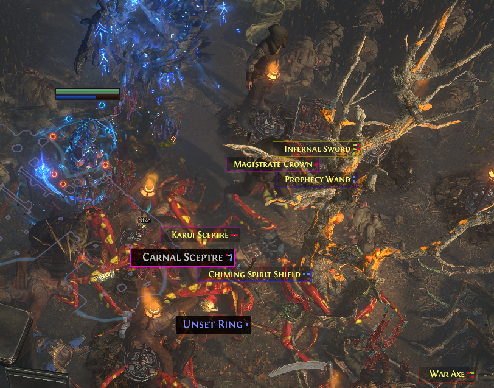
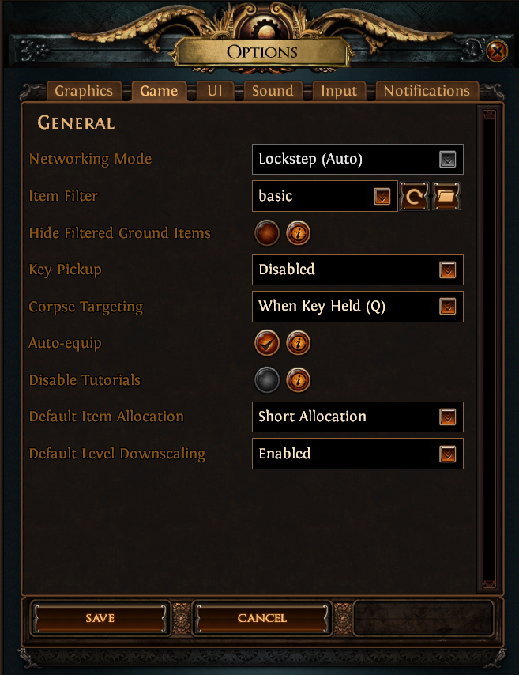

# Path of Exile 1 & 2 - filters

Latest filter is compatible with Path of Exile 2 v0.3
Basic filters for path of exile

## Info
Place the .filter file in the "Path of Exile" map in My Games on Windows. 
The path should be something like C:\Users\youruser\Documents\My Games\Path of Exile\

### 1. Basic. Universal filter for every class.
This filter hides white and blue items unless they have max sockets with all connections

    
### 2. NeverSink's Indepth Loot Filter
Full credit to NeverSink. I copied this very elaborate filter here as a reference.

### 3. Stat requirement borders. Universal filter for every class.
Basic filter + border colors based on required stats. (Work in progress, always adding newly found items)

#### **hidden** items
- white and blue wearable items that
  - haven't got the maximum amount of sockets
    AND
  - haven't got all their sockets linked.
- white and blue rings without a socket.
- white and blue amulets, that aren't Onyx.
- white and blue quivers
- white and blue belts
- white flasks of types Utility, Life, Mana, Hybrid

#### Highlight Rare items that do not have max linked sockets
- 50% transparant background
- 50% transparent colored border (border color: see next point)
- slightly smaller font

#### Wearable items get borders
- border color dependent on stats required
  
| Stat requirements | Border color |
| ----------------- | ------------ |
| int               |  dark blue |
| int > str         |  violet |
| int = str         |  purple |
| int < str         |  magenta / deep pink |
| str               |  red |
| str > dex         |  vibrant orange |
| str = dex         |  yellow |
| str < dex         |  lime green |
| dex               |  green |
| dex > int         |  teal |
| dex = int         |  cyan |
| dex < int         |  azure |

#### Highlighted items on minimap
- all orbs get a purple triangle on the map

## Configuration

